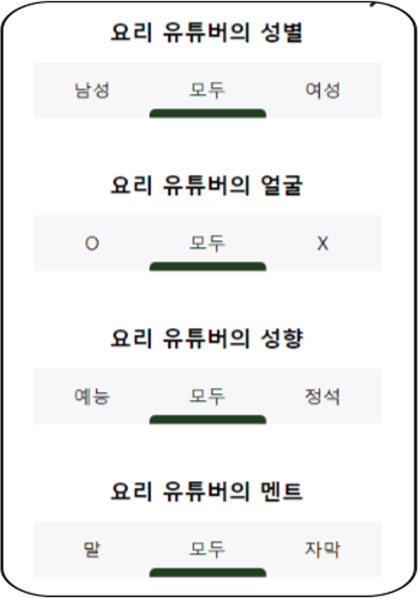

# JustBoil-Client
# 23-2 Algorithm Project

이 서비스는 현재 날씨에 적합한 음식을 랜덤으로 추천합니다. 예를 들어, 비 오는 날에는 따뜻한 국물 요리를, 더운 날에는 시원한 음식을 추천해줄 수 있습니다.

특정 음식을 먹고 싶을 때 그 음식을 검색하면 관련 레시피 영상들을 추천해줍니다. 이를 통해 사용자는 원하는 요리를 쉽게 찾을 수 있습니다.

추천된 레시피 영상을 클릭하면 영상의 주요 내용을 텍스트로 요약해 보여줍니다. 이는 사용자가 영상을 시청하기 전에 요리의 개요를 빠르게 파악할 수 있게 해줍니다.

사용자는 자신의 취향에 맞게 레시피를 추천받기 위해 개인적인 선호도를 모달 창을 통해 입력할 수 있습니다. 이는 사용자의 식사 시간과 영양 선호, 알레르기 유무 등 다양한 요소를 고려하여 맞춤형 레시피를 제공합니다.
